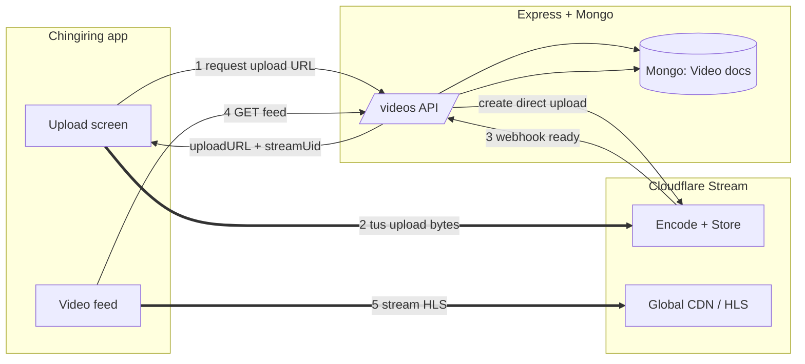
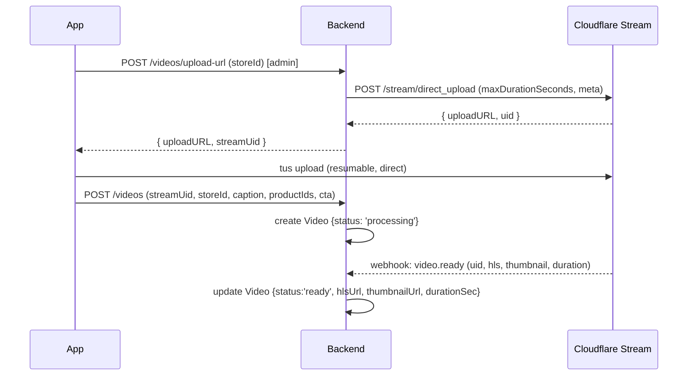

# PRD — "Videos": Shoppable Business Reels for Chingiring

| | |
|---|---|
| **Status** | Draft for review |
| **Date** | 2026-08-08 |
| **Owner** | Product / Eng |
| **Branch context** | `feat/sharesheet-preview` |
| **Related** | Offline Stores, Share-to-earn wallet, Deals, Products |

---

## 1. TL;DR

Turn the placeholder **Videos** tab into a full-screen, vertical, swipeable short-video feed — Instagram Reels mechanics, but a **professional, business-first** feed. Verified **stores** post short clips that promote their products and storefront; every clip is **shoppable** (tap a tagged product → existing Product Detail; tap the store → existing store screen).

**v1 is deliberately lean:** feed + upload + shoppable tags + like/share/save + view analytics + admin moderation. Comments, follows, music, paid boost, share-to-earn coins on videos, and public (user) posting are **phased later**.

**Video is not stored or served by our servers.** We use **Cloudflare Stream** (managed): the app uploads directly to Cloudflare and streams from Cloudflare's global CDN. Our Express/Mongo backend only stores metadata. This keeps bandwidth cost and scaling risk off our infrastructure and lets us ship in weeks, not months.

**Cost at launch scale ≈ $210/mo (~₹18k).** It scales linearly with watch-time; a documented trigger tells us when to migrate to self-hosted (Cloudflare R2, zero egress) to cut the bill by an order of magnitude.

---

## 2. Background & why now

- The bottom nav was redesigned (Figma 21:2130) to five tabs — **Videos · Stores · Home · Wallet · Profile** — and `MobileVideosScreen.tsx` currently ships a "Coming soon" placeholder. Its own copy already promises: *"Watch deal walkthroughs, product reviews, and earn coins along the way."* The intent (shoppable video + coins) predates this doc.
- Chingiring already has the commerce primitives a shoppable video feed needs: `Store`, `Product`, `Deal`, `shares` (share-to-earn), `clicks` (attribution), `wallet`/`transactions` (coins). Video is the missing **top-of-funnel discovery surface** that drives attention into those primitives.
- Short vertical video is now the default discovery format for commerce (Reels/TikTok/Shorts). A business-first feed differentiates from consumer UGC apps and keeps the content brand-safe and on-mission.

---

## 3. Goals, non-goals, success metrics

### Goals
1. Ship a smooth, native-feeling vertical video feed that autoplays and swipes like Reels.
2. Make every video **shoppable** — a direct, measurable path from watch → product/store.
3. Give stores (via admin in v1) a dead-simple way to publish a clip.
4. Keep infrastructure cost predictable and off our own bandwidth.
5. Instrument everything so we can prove engagement → commerce.

### Non-goals (v1)
- Public/user (UGC) posting — Phase 3.
- Comments, follows/subscriptions, DMs — Phase 2.
- Music/sound library, filters, effects, remixes — Phase 2+.
- In-video checkout — we deep-link to the existing PDP/cart; no new checkout.
- Coin rewards wired to videos — Phase 2 (reuses `shareModel`).
- Live streaming — later; Cloudflare Stream supports it when we want it.

### Success metrics (first 90 days post-launch)
| Metric | Target |
|---|---|
| Feed engagement | ≥ 40% of DAU open Videos; ≥ 3 min median session in-feed |
| Completion | ≥ 45% average view-through on ≤30s clips |
| Commerce CTR | ≥ 6% of video views tap a product/store tag |
| Catalog | ≥ 200 published clips across ≥ 50 stores by day 90 |
| Cost | Blended video infra < ₹0.02 per video view |
| Reliability | < 1% playback error rate; p75 time-to-first-frame < 1.2s on 4G |

---

## 4. Personas

- **Viewer (shopper)** — existing app user browsing for deals; wants entertaining, trustworthy product discovery.
- **Store (advertiser)** — an onboarded offline/online store wanting cheap, high-intent reach for products and footfall. In v1 they hand assets to ops; Phase 2 they self-serve.
- **Admin / Ops** — curates and uploads on behalf of stores, runs the moderation queue, features clips.

---

## 5. Scope

### v1 — MVP (this PRD's build target)
1. **Vertical feed** — full-screen, one clip per screen, swipe up/down, autoplay-on-focus, tap-to-mute, loop.
2. **Shoppable overlay** — store handle + logo, caption, product tag chip(s) → PDP, primary CTA ("Shop" / "Visit store").
3. **Engagement rail** — like, save, share (native share sheet), mute. Counts persisted.
4. **Upload (admin-curated)** — admin picks/records a clip, attaches it to a `Store`, writes a caption, tags products, publishes. Reuses the Admin module.
5. **Store video grid** — a store's clips shown on its store screen / a mini profile.
6. **Moderation** — admin queue: pending → approved/rejected/removed; hard-remove pulls from feed instantly.
7. **Analytics** — views, unique views, watch-seconds, completion, likes, shares, saves, product taps, store taps.

### Phased roadmap
| Phase | Adds |
|---|---|
| **Phase 2** | Business self-serve login (`role: 'business'`, `Store.owner`), in-app record+trim, **share-to-earn coins on video shares** (reuse `shareModel`, 100/day cap), comments, follows, "boost" (paid promotion), basic music/sounds. |
| **Phase 3** | Public/user (UGC) posting + trust & safety tooling (auto-moderation, reporting, rate limits), recommendation ranking (engagement model), duets/remixes. |
| **Phase 4 (cost)** | Migrate delivery to self-host (Cloudflare R2 + CDN + own encode) **only when the cost trigger fires** (§10). Live streaming if demanded. |

---

## 6. User stories (v1)

- As a **viewer**, I open Videos and immediately see a playing clip; I swipe up for the next; I tap a product to open its page; I share a clip to WhatsApp.
- As a **viewer**, I tap the store name and land on that store; I save a clip to come back to.
- As **admin**, I upload a store's clip, tag two of its products, and publish; it appears in the feed within seconds of Cloudflare finishing encode.
- As **admin**, I see a moderation queue and can remove a clip; it disappears from every feed immediately.
- As a **store** (Phase 2), I log in, record a 20s clip, tag products, and publish myself.

---

## 7. UX / screens

**Chosen direction: B — "Shop-forward"** (selected from the 3-variant mockup, 2026-08-08). The product and price stay on screen; the feed optimizes for the ≥6% commerce-CTR goal. Social affordances (follow, prominent likes) are intentionally light in v1 and grow in Phase 2.

### 7.1 Feed (`MobileVideosScreen` — replaces placeholder)
- **Layout:** edge-to-edge `FlatList` (vertical, `pagingEnabled`, `snapToInterval = screenHeight`), one `VideoItem` per page. Dark, immersive; status bar light.
- **Playback:** only the on-screen item plays (viewability-gated). Next item **preloads** (buffer 1 ahead). Tap toggles mute; long-press pauses (Phase 2). Auto-loop.
- **Store pill (top-left):** store logo + name + verified tick → store screen.
- **Caption:** short, above the product card (2 lines, expandable).
- **Docked product card (bottom, above tab bar):** product thumbnail + name + **price** (+ struck MRP & discount badge when present) + **"Shop now"** button → existing PDP. This is the primary shoppable action and the defining element of Direction B.
- **Slim rail (bottom-right):** like ❤ + share ↗ (native share sheet with deep link). Save and mute are secondary (mute as a small tap-toggle on the video).
- **Multi-product:** if a clip tags >1 product, the card becomes a small horizontal carousel; CTA reads "Shop (N)".
- **Empty/error/offline:** graceful poster-image fallback + retry.

### 7.2 Upload (admin in v1; store in Phase 2)
- Pick from gallery (`expo-image-picker`, already installed) or record (`expo-camera`, installed) — v1 can ship gallery-only to cut scope.
- Constraints: ≤ 60s, portrait 9:16 preferred, ≤ 200 MB source.
- Form: select `Store`, caption, tag products (search that store's catalog), pick CTA type, publish.
- Shows encode status (processing → ready) via backend polling of Cloudflare state.

### 7.3 Store video grid
- A tab/section on the store screen: thumbnail grid of that store's `ready` clips → opens feed scoped to the store.

---

## 8. Technical architecture

### 8.1 Principle: metadata on us, bytes on Cloudflare
The app uploads video **directly to Cloudflare Stream** and plays **directly from Cloudflare's CDN**. Our backend issues short-lived upload URLs, stores metadata in Mongo, and receives a webhook when encoding finishes. No video byte transits our Express server.



### 8.2 Ownership & account model
- A **Video belongs to a `Store`** (existing model). There is no per-video "user" author in v1.
- `User.role` is currently `['user','admin']`. **v1 gates creation to `admin`** — ops uploads on a store's behalf. This reuses the existing Admin screens/patterns (cf. `AdminDealsScreen`) and adds **zero new auth**.
- **Phase 2** adds business self-serve: extend role enum with `'business'`, add `Store.owner → User`, and gate create to `admin` OR the store's owner. The v1 API is designed so this is an authorization change only — no schema rewrite.

### 8.3 Upload sequence (detail)



- **Resilience:** a scheduled reconcile job polls Cloudflare for any `Video` stuck in `processing` > N minutes (webhooks can be missed).
- **Security:** webhook verified via Cloudflare's signature header + shared secret; upload URLs are single-use and short-lived.

### 8.4 Playback & feed
- **Player:** `expo-video` (official, Expo SDK 54) playing Cloudflare **HLS** (`.../manifest/video.m3u8`). Adaptive bitrate handled by Cloudflare — mobile networks get a lower rendition automatically.
- **Feed API:** cursor-paginated (`publishedAt`/`_id`), page size ~5. v1 ranking = **recency + featured boost + light engagement weighting** (business-first, low volume → no ML needed). Ranking is a single pure function, swappable in Phase 3.
- **Access control:** v1 videos are public content → public playback URLs are fine. If we later need gating, switch Cloudflare to **signed URLs** (backend mints tokens) — no client rearchitecture.

### 8.5 Data model — one new collection

```js
// backend/src/modules/videos/videoModel.js
Video {
  store:        ObjectId → Store,      // owner (existing model)
  createdByAdmin: ObjectId → User,     // audit; v1 always an admin
  streamUid:    String,                // Cloudflare Stream asset id
  status:       'processing'|'ready'|'error'|'flagged'|'removed',
  hlsUrl:       String,
  thumbnailUrl: String,
  durationSec:  Number,
  caption:      String,
  hashtags:     [String],
  taggedProducts: [ObjectId → Product],
  cta:          { type: 'shop'|'store'|'none', productId?, url? },
  stats:        { views, uniqueViews, watchSec, likes, shares, saves, productTaps, storeTaps },
  moderation:   { state, reviewedBy, reason, at },
  isFeatured:   Boolean,
  publishedAt:  Date,
}
// Indexes: {status, publishedAt}, {store, status}, {isFeatured, publishedAt}
```

**Reuse (no new collections):**
- **Shares** → reuse `shareModel` (adds `videoId`) so Phase 2 share-to-earn coins work with zero rework and existing 100/day cap logic.
- **Product taps** → reuse `clickModel` for tap attribution (feeds the same cashback/attribution pipeline noted for Amazon).
- **Likes/saves** → lightweight `VideoInteraction {user, video, type}` collection, or embedded sets; decide in planning (favor a small join collection for scale).

### 8.6 API surface

| Method | Route | Auth | Purpose |
|---|---|---|---|
| POST | `/api/videos/upload-url` | admin | Create Cloudflare direct-upload URL |
| POST | `/api/videos` | admin | Create Video metadata (post-upload) |
| POST | `/api/videos/webhook` | Cloudflare sig | Encode status callbacks |
| GET | `/api/videos/feed?cursor=` | public | Ranked, paginated feed |
| GET | `/api/videos/:id` | public | Single video |
| GET | `/api/videos/store/:storeId` | public | A store's clips (grid) |
| POST | `/api/videos/:id/view` | user/anon | Increment view + report watch-seconds |
| POST | `/api/videos/:id/like` · `/save` · `/share` | user | Engagement |
| PATCH | `/api/admin/videos/:id` | admin | Moderation state / feature |
| DELETE | `/api/videos/:id` | admin | Remove (also best-effort delete from Cloudflare) |

Module layout mirrors existing backend: `backend/src/modules/videos/{videoModel,videoController,videoRoutes}.js` + `services/cloudflareStream.js` (thin REST client using Node's built-in `fetch`).

### 8.7 Client implementation notes
- **Feed perf:** virtualize with `FlatList` (`windowSize` small, `removeClippedSubviews`), one mounted player + preload-next; recycle players to avoid mounting N `expo-video` instances. Zustand holds `{activeIndex, muted}`.
- **View accounting:** count a "view" at ≥ 2s or 50% (whichever first, TikTok-style); batch `watchSec` and flush on swipe/blur to avoid chatty requests.
- **Deep links:** extend `linking.ts` (already has `Videos: 'videos'`) with `videos/:id` for shareable links.

### 8.8 New dependencies & config
- **Client:** `expo-video` (only new dep). Reuses installed `expo-image-picker`, `expo-camera`, `reanimated`, `@tanstack/react-query`, `zustand`, `lucide-react-native`.
- **Backend:** none new (native `fetch`). Env: `CLOUDFLARE_ACCOUNT_ID`, `CLOUDFLARE_STREAM_API_TOKEN`, `CLOUDFLARE_STREAM_WEBHOOK_SECRET`.

---

## 9. Storage & infrastructure

### 9.1 Recommendation: Cloudflare Stream
For a business-first MVP that is **India-first**, cost-sensitive, and small-team:

| Provider | Encode | Storage | Delivery | Fit |
|---|---|---|---|---|
| **Cloudflare Stream** ✅ | **free** | $5 / 1,000 min stored / mo (=$0.005/min) | $1 / 1,000 min delivered (=$0.001/min) | **Flat pricing globally incl. India**; billed by **duration** (predictable, not bandwidth-guesswork); free encoding; resumable `tus` direct upload; signed URLs available; clean migration path to R2 self-host. |
| Mux | $0.0075/min | $0.015/GB/mo | $0.00059/min | Cheapest delivery line + best-in-class analytics/DX. Per-GB storage + regional/quality nuance make totals less predictable. Strong alternative. |
| Bunny Stream | free (H.264 ≤1080p) | $0.01/GB/mo | from $0.01/GB | Cheapest per-GB in EU/NA, but **Asia/India egress is a higher tier**; per-GB billing needs bitrate modeling. |
| Self-host (R2 + CDN + encode) | you build (MediaConvert/ffmpeg) | R2 $0.015/GB/mo, **$0 egress** | your CDN | Best at large scale; real eng + ops. The Phase-4 destination, not the start. |

**Why Cloudflare Stream for v1:** simplest to ship, **flat global rate removes India-egress surprises**, duration billing makes the finance model trivial, free encoding, and because Cloudflare **R2 has zero egress fees**, the eventual self-host migration is a natural next step on the same vendor.

> Honest caveat: Mux's per-minute *delivery* is ~40% cheaper at list, and its analytics are deeper. If watch-time analytics or delivery unit-cost dominate the decision, Mux is the pick. For predictability + India + speed-to-ship, Cloudflare Stream wins.

---

## 10. Cost model

**Assumptions:** avg clip **30s (0.5 min)**; avg **watched 0.4 min/view**; Cloudflare Stream list pricing.

```
Monthly storage  = library_minutes  × $0.005
Monthly delivery = views × watch_min × $0.001      (≈ MAU × video-min-watched/mo × $0.001)
```

| Stage | Library | Watch demand | Storage | Delivery | **Total /mo** |
|---|---|---|---|---|---|
| **Launch** | 5,000 clips (2.5k min) | 10k MAU × 20 min | $12.5 | ~$200 | **≈ $210** (~₹18k) |
| **Growth** | 40,000 clips (20k min) | 100k MAU × 30 min | $100 | ~$3,000 | **≈ $3,100** (~₹2.6L) |
| **Scale** | 400,000 clips (200k min) | 1M MAU × 40 min | $1,000 | ~$40,000 | **≈ $41,000** (~₹35L) |

*(₹ at ≈ ₹85/$.)*

**Key facts:**
- **Delivery (watch-time) dominates** — 90%+ of the bill at every stage. Storage is negligible.
- Cost scales with **engagement, not catalog size** — a healthy problem, but watch it.

**Build-vs-buy trigger:** when **delivery > ~$3–5k/mo** (roughly the Growth stage), evaluate migrating delivery to **Cloudflare R2 (zero egress) + own encoding**. At Scale this can cut the ~$40k delivery line to low single-digit thousands — an order-of-magnitude saving that justifies the eng cost only once volume is real. **Do not pre-build it.**

**Cost controls from day one:** cap clip length (≤60s), cap max rendition on cellular (720p), lazy-load (don't autoplay off-screen), count views at 2s to avoid inflating delivery on accidental swipes, and set Cloudflare storage retention so unpublished/rejected assets are deleted.

---

## 11. Moderation & trust/safety
- **v1 is inherently safer:** only admin publishes, only for verified stores → brand-safe by construction.
- **Queue:** every upload lands `processing` → admin approves to `ready`/feed. `PATCH /admin/videos/:id` sets `flagged`/`removed`; removal pulls from feed instantly and best-effort deletes the Cloudflare asset.
- **Phase 3 (UGC) prerequisites:** in-app reporting, rate limits, automated screening (Cloudflare/3rd-party moderation or a review SLA), and a strike system. UGC does **not** ship until these exist.

---

## 12. Analytics & event tracking
Emit to existing analytics + persist counters on `Video.stats`:

| Event | Fires when | Key fields |
|---|---|---|
| `video_impression` | item becomes ≥50% visible | videoId, storeId, index |
| `video_view` | ≥2s or ≥50% watched | videoId, watchSec |
| `video_complete` | loops / reaches end | videoId, completionPct |
| `video_like` / `_save` / `_share` | rail tap | videoId, target |
| `video_product_tap` | product chip/CTA tap | videoId, productId (→ `clickModel`) |
| `video_store_tap` | store handle/CTA tap | videoId, storeId |

These power the success metrics (§3) and the funnel **view → tap → PDP → purchase/cashback**, tying video into the existing clicks/attribution pipeline.

---

## 13. Security & privacy
- Upload URLs single-use, short TTL, admin-only.
- Webhook authenticated (Cloudflare signature + `CLOUDFLARE_STREAM_WEBHOOK_SECRET`).
- No PII in video metadata or URLs.
- Rate-limit engagement endpoints (existing `express-rate-limit`).
- v1 content is public; if gating is ever needed, flip Cloudflare to signed URLs (backend-minted tokens) — no client rework.

---

## 14. Performance targets
- p75 time-to-first-frame < 1.2s on 4G; smooth 60fps swipe; ≤ 1 mounted player + 1 preloaded; < 1% playback error rate. Poster/thumbnail shows instantly while the manifest loads.

---

## 15. Risks & mitigations
| Risk | Mitigation |
|---|---|
| Watch-time cost blows up at scale | Delivery-dominant model is known; R2 self-host trigger defined (§10); cellular rendition cap; 2s view counting. |
| Janky playback in a swipe feed | `expo-video` + viewability-gated single active player + preload-next + player recycling. |
| Missed encode webhooks → stuck `processing` | Reconcile job polls Cloudflare; upload screen polls status. |
| Thin content at launch (cold start) | Admin-curates a seed library from top stores before launch; feature/boost surfacing. |
| No business-author identity yet | v1 admin-curated (zero auth work); Phase 2 adds `role:'business'` + `Store.owner` as an authz-only change. |
| Moderation load if UGC opened early | UGC gated behind Phase 3 trust-&-safety prerequisites. |

---

## 16. Open questions
1. v1 upload: gallery-only, or also in-app record? (Recommend gallery-only to cut scope; record in Phase 2.)
2. Likes/saves storage: small join collection vs embedded — decide in planning (favor join for scale).
3. Feed ranking v1: pure recency, or recency + featured + light engagement? (Recommend the latter — trivial and better.)
4. Seed strategy: how many clips / which stores before launch?
5. Do we localize captions/hashtags now or later?

---

## 17. Rollout / milestones
1. **M1 — Backend spine:** `videos` module, Cloudflare service, upload-URL + create + webhook + reconcile, admin create/moderate.
2. **M2 — Feed client:** `expo-video` feed, autoplay/preload, overlay + rail + CTA, deep links.
3. **M3 — Shoppable + analytics:** product/store tags → existing screens, event instrumentation, `Video.stats`.
4. **M4 — Admin & moderation UI:** upload form, moderation queue, feature toggle; seed content.
5. **M5 — Hardening:** perf pass, error/offline states, cost dashboards, launch.
6. **Post-launch:** monitor cost + engagement; schedule Phase 2 (coins, comments, self-serve).

---

## Appendix — pricing sources (verified 2026-08-08)
- Cloudflare Stream — $5/1,000 min stored, $1/1,000 min delivered, free encoding/ingress, flat global, no minimum: <https://developers.cloudflare.com/stream/pricing>
- Mux Video pricing — encode $0.0075/min, storage $0.015/GB/mo, delivery $0.00059/min: <https://www.mux.com/pricing>
- Bunny Stream pricing — storage $0.01/GB/mo, delivery from $0.01/GB, free H.264 ≤1080p encode: <https://bunny.net/pricing/stream/>
- Cloudflare R2 (zero egress) — for the Phase-4 self-host path: <https://developers.cloudflare.com/r2/pricing/>
